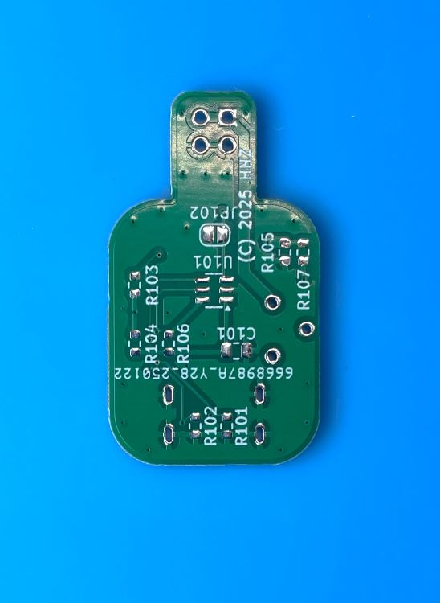

  <h1><code>BREAD BOARD POWER ALLIGATOR</code></h1>
  

    
  

# BREAD BOARD POWER ALLIGATOR : Power Supply for Bread-Board

This is power supplies for bread-board. They are designed to be used with a USB PD power supply. The output voltage is from 3.3V to 20V, and the output current is maximum 1A. The output voltage is fixed each adoptor. I made 6 adoptors for bread-board power supply. The adoptors are 3.3V, 5V, 9V, 12V, 15V, and 20V. The adoptors are connected to the bread-board such an alligator clips. It is easy to set up the power supply for the bread-board. If you use a USB PD power supply, you can use over 9V output. If it is not USB PD, you can use only 3.3V or 5V.

The PCB is designed by KiCad. The PCB is common to all adoptors. 

## How to use
Just connect a USB PD power supply to the USB-C connector. Then, connect the adoptor to the bread-board. The output voltage is fixed each adoptor. If it turns on the power supply, the LED lights up. 

Be careful to connect the adoptor to the bread-board. The inside of the bread-board power line is +, so connect it so that the top is -. Also, be careful not to connect different adoptors to the same bread-board.

## Schematic
Each adoptor has a different output voltage. The output voltage is determined by any of the following parts.

[Schematic PDF File](doc/schematic.pdf)

|Output Voltage|U102|D102|C101|C104|R103|R104|R105|R106|JP101|JP102|
|---|---|--|--|--|--|--|--|--|--|--|
|3.3V|AZ1117CH-3.3|CUS10F3D|DNP|10uF|1K|DNP|0|DNP|OPEN|SHUNT|
|5V|DNP|DNP|DNP|DNP|1K|DNP|DNP|DNP|SHUNT|SHUNT|
|9V|DNP|DNP|1uF|DNP|2K|1K|DNP|20K|SHUNT|OPEN|
|12V|DNP|DNP|1uF|DNP|2K|1K|DNP|47K|SHUNT|OPEN|
|15V|DNP|DNP|1uF|DNP|2K|1K|DNP|100K|SHUNT|OPEN|
|20V|DNP|DNP|1uF|DNP|2K|1K|DNP|200K|SHUNT|OPEN|

*1 DNP: Do Not Populate
*2 R107 is DNP for all adoptors.

If you want to change the output voltage, you can change the parts of the table.
e.g If you want to change the output voltage to 1.8V or 2.5V, you can change the parts as follows.
|Output Voltage|U102|D102|C101|C104|R103|R104|R105|R106|JP101|JP102|
|---|---|--|--|--|--|--|--|--|--|--|
|1.8V|AZ1117CH-1.8|CUS10F3D|DNP|10uF|1K|DNP|0|DNP|OPEN|SHUNT|
|2.5V|AZ1117CH-2.5|CUS10F3D|DNP|10uF|1K|DNP|0|DNP|OPEN|SHUNT|

## PCB

*3 In the photo, the PCB is designed to accommodate a Switch, but it was removed from the PCB layout because a compatible Switch could not be found.

# Container

There are STL data for 3D printer in the `stl` directory.
bottom.stl is the bottom of the container. upper-al-xx.stl is the upper of the container like alligator clips. upper-simple_xx.stl is the upper of the container like a battery form.

## LICENSE
Hardware Schematic Documents are licensed under CC-BY-SA V4.0.